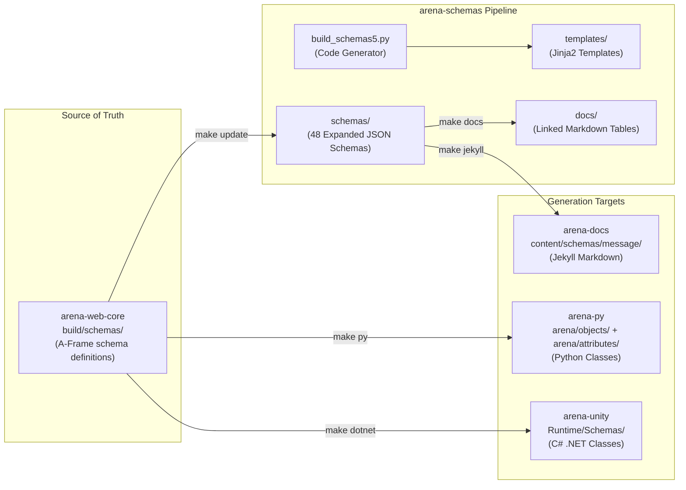
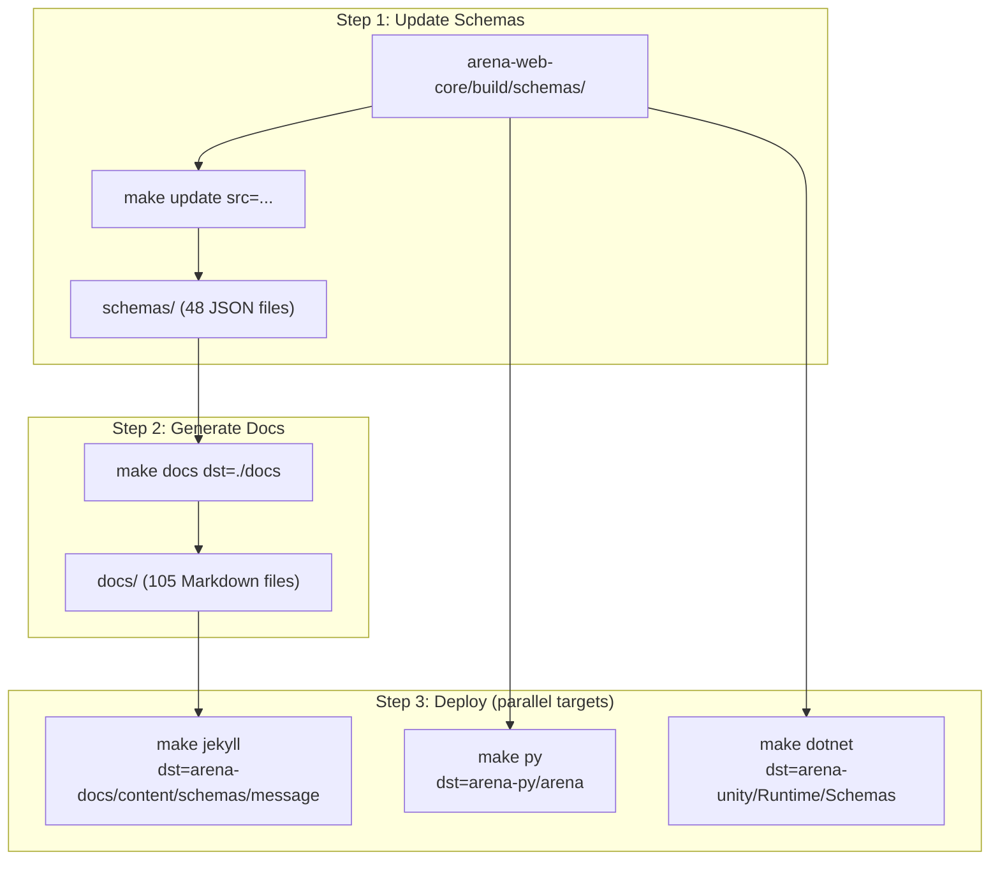

# ARENA Schemas — Requirements & Architecture

> **Purpose**: Machine- and human-readable reference for the ARENA schema definitions and multi-target code generation pipeline.

## Architecture

## Source File Index

| File / Directory | Role | Key Symbols |
|------------------|------|-------------|
| [build_schemas5.py](build_schemas5.py) | Main generator: JSON expansion, Markdown, Python, C#, Jekyll | `generate_json`, `generate_docs`, `generate_jekyll`, `generate_py`, `generate_dotnet` |
| [Makefile](Makefile) | Build targets | `update`, `docs`, `jekyll`, `py`, `dotnet` |
| [schemas/](schemas/) | 48 expanded JSON schemas | `box.json`, `sphere.json`, `gltf-model.json`, `light.json`, `camera.json`, `entity.json`, `scene-options.json`, `arena-program.json`, etc. |
| [schemas/definitions-common.json](schemas/definitions-common.json) | Shared component/attribute definitions (70+ components) | `position`, `rotation`, `scale`, `material`, `animation`, `physx-body`, etc. |
| [schemas/arena-schema-files.json](schemas/arena-schema-files.json) | Schema registry (file list + metadata) | list of all schema files |
| [templates/](templates/) | Jinja2 code generation templates (10 files) | Python class, C# class, Markdown table templates |
| [docs/](docs/) | Generated Markdown documentation (105 files) | linked tables of schema properties |
| [requirements.txt](requirements.txt) | Python dependencies | `jsonschema`, `jinja2` |

## Feature Requirements

### Schema Expansion

| ID | Requirement | Source |
|----|-------------|--------|
| REQ-SC-001 | Parse `arena-schema-files.json` from arena-web-core build output | [build_schemas5.py](build_schemas5.py) |
| REQ-SC-002 | Expand JSON Schema `$ref` references into standalone files | [build_schemas5.py](build_schemas5.py) |
| REQ-SC-003 | Output 48 expanded JSON schema files to `schemas/` | [schemas/](schemas/) |
| REQ-SC-004 | Common definitions: 70+ shared component/attribute schemas | [schemas/definitions-common.json](schemas/definitions-common.json) |

### Documentation Generation

| ID | Requirement | Source |
|----|-------------|--------|
| REQ-SC-010 | Markdown table generation with linked property descriptions | [build_schemas5.py](build_schemas5.py) |
| REQ-SC-011 | Jekyll site generation with YAML frontmatter for arena-docs | [build_schemas5.py](build_schemas5.py) |
| REQ-SC-012 | Auto-generated `index.md` from schema registry | [build_schemas5.py](build_schemas5.py) |

### Python Code Generation

| ID | Requirement | Source |
|----|-------------|--------|
| REQ-SC-020 | Generate Python object classes for arena-py | [build_schemas5.py](build_schemas5.py) |
| REQ-SC-021 | Generate Python attribute/component classes | [build_schemas5.py](build_schemas5.py) |
| REQ-SC-022 | Update docstrings in existing classes; generate missing classes | [build_schemas5.py](build_schemas5.py) |
| REQ-SC-023 | Output to `arena-py/arena/objects/` and `arena-py/arena/attributes/` | [build_schemas5.py](build_schemas5.py) |

### C# Code Generation

| ID | Requirement | Source |
|----|-------------|--------|
| REQ-SC-030 | Generate C# .NET JSON serialization classes for arena-unity | [build_schemas5.py](build_schemas5.py) |
| REQ-SC-031 | Full overwrite of `arena-unity/Runtime/Schemas/` on each run | [build_schemas5.py](build_schemas5.py) |
| REQ-SC-032 | Proper C# naming conventions and Newtonsoft.Json attributes | [build_schemas5.py](build_schemas5.py) |

### Schema Coverage

| ID | Requirement | Source |
|----|-------------|--------|
| REQ-SC-040 | 48 object type schemas (primitives, models, UI, programs, scene options) | [schemas/](schemas/) |
| REQ-SC-041 | Scene options schema (environment, renderer settings) | [schemas/arena-scene-options.json](schemas/arena-scene-options.json) |
| REQ-SC-042 | Program schema (ARENA runtime application definitions) | [schemas/arena-program.json](schemas/arena-program.json) |
| REQ-SC-043 | Event schema (click, collision, etc.) | [schemas/event.json](schemas/event.json) |

## Generation Pipeline

## Planned / Future

- Schema validation CI checks
- Automated cross-repo PR creation on schema changes
- Additional target language generators
